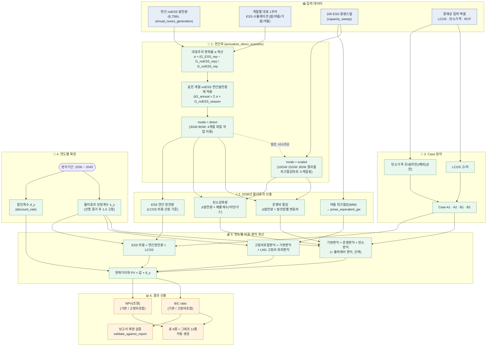

```mermaid
flowchart TD

    subgraph INPUT["📥 입력 데이터"]
        A1["연간 noESS 발전량<br/>(8,736h, annual_noess_generation)"]
        A2["계절별 대표 1주차<br/>ESS 시뮬레이션 (봄/여름/가을/겨울)"]
        A3["10h ESS 용량스윕<br/>(capacity_sweep)"]
        A4["경제성 입력 엑셀<br/>LCOS · 탄소가격 · RCP"]
    end

    subgraph STEP1["🔁 1. 연간화 (annualize_direct_scenario)"]
        B1["대표주차 변화율 α 계산<br/>α = (G_ESS_rep − G_noESS_rep) / G_noESS_rep"]
        B2["같은 계절 noESS 연간발전량에 적용<br/>ΔG_annual = Σ α × G_noESS_season"]
        B3["mode = direct<br/>(3GW·8GW: 4계절 파일 직접 이용)"]
        B4["mode = scaled<br/>(10GW·15GW: 8GW 결과를<br/>피크절감비로 스케일링)"]
    end

    subgraph STEP2["⚡ 2. 2038년 물리효과 산출"]
        C1["운영비 절감<br/>Δ발전량 × 발전원별 변동비"]
        C2["탄소감축량<br/>Δ발전량 × 배출계수(석탄/가스)"]
        C3["여름 피크절감(MW)<br/>→ pmax_equivalent_gw"]
        C4["ESS 연간 방전량<br/>(LCOS 비용 산정 기준)"]
    end

    subgraph STEP3["🧮 3. Case 정의"]
        D1["LCOS 고/저"]
        D2["탄소가격 국내(하한)/해외(상한)"]
        D3["Case A1 · A2 · B1 · B2"]
    end

    subgraph STEP4["📅 4. 연도별 확장"]
        E0(["분석기간: 2030 ~ 2045"])
        E1["물리효과 보정계수 s_y<br/>(선형 증가 후 1.0 고정)"]
        E2["할인계수 d_y<br/>(discount_rate)"]
        E0 --> E1
        E0 --> E2
    end

    subgraph STEP5["💰 5. 연도별 비용·편익 계산"]
        F1["기본편익 = 운영편익 + 탄소편익<br/>(+ 출력제어 편익, 선택)"]
        F2["고정비포함편익 = 기본편익 + LNG 고정비 회피편익"]
        F3["ESS 비용 = 연간방전량 × LCOS"]
        F4["현재가치화 PV = 값 × d_y"]
    end

    subgraph STEP6["📊 6. 결과 산출"]
        G1["B/C ratio<br/>(기본 / 고정비포함)"]
        G2["NPV(조원)<br/>(기본 / 고정비포함)"]
        G3["표 9종 + 그래프 12종<br/>자동 생성"]
        G4["보고서 재현 검증<br/>validate_against_report"]
    end

    A1 --> B1
    A2 --> B1
    B1 --> B2
    B2 --> B3
    A3 --> B4
    B3 -. 참조 시나리오 .-> B4

    B3 --> C1
    B4 --> C1
    B3 --> C2
    B4 --> C2
    A3 --> C3
    B3 --> C4

    A4 --> D1
    A4 --> D2
    D1 --> D3
    D2 --> D3

    C1 --> F1
    C2 --> F1
    C3 --> F2
    C4 --> F3
    D3 --> F1
    D3 --> F3
    E1 --> F1
    E1 --> F2
    E1 --> F3
    E2 --> F4

    F1 --> F4
    F2 --> F4
    F3 --> F4

    F4 --> G1
    F4 --> G2
    G1 --> G3
    G2 --> G3
    G1 --> G4

    classDef input fill:#e8eef7,stroke:#4a6fa5,color:#1a2b3d;
    classDef process fill:#eaf7ee,stroke:#4a9d5f,color:#1a2b3d;
    classDef result fill:#fff3e0,stroke:#c98a1f,color:#1a2b3d;
    class A1,A2,A3,A4 input;
    class B1,B2,B3,B4,C1,C2,C3,C4,D1,D2,D3,E1,E2,F1,F2,F3,F4 process;
    class G1,G2,G3,G4 result;
```

