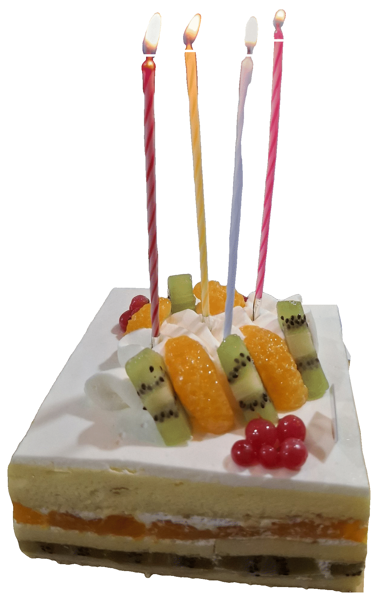

오빠의 생일 케이크를 사기 위해 오랜만에 백화점에 갔다. 백화점 인파가 문득 너무 생경하게 느껴졌다. 나와는 무관한 세상 같이 

생크림 과일 케이크를 샀는데, 오빠는 치즈 케이크를 좋아한다고 했다. 나름 서프라이즈였으니까 어쩔 수 없다고 생각했다. 그래도 다음엔 치즈 케이크를 사야겠다. 

가족들과 함께 생일 케이크에 둘러앉아 케이크를 먹으니, 꽤나 잘 지내고 있는 기분이었다. 근래 드문 기분이다. 오빠는 가족의 건강을 소원으로 빌었다고 했다. 건강이 최고다, 예방접종 맞아서 예방할 수 있는 것이라면 아무리 비싸도 맞는게 좋다, 아프면 병원비 걱정 말고  진료든 치료든 잘 받아야 한다, 따위 말을 오랫동안 주고받았다. 정말이지 건강이 최고니까. 