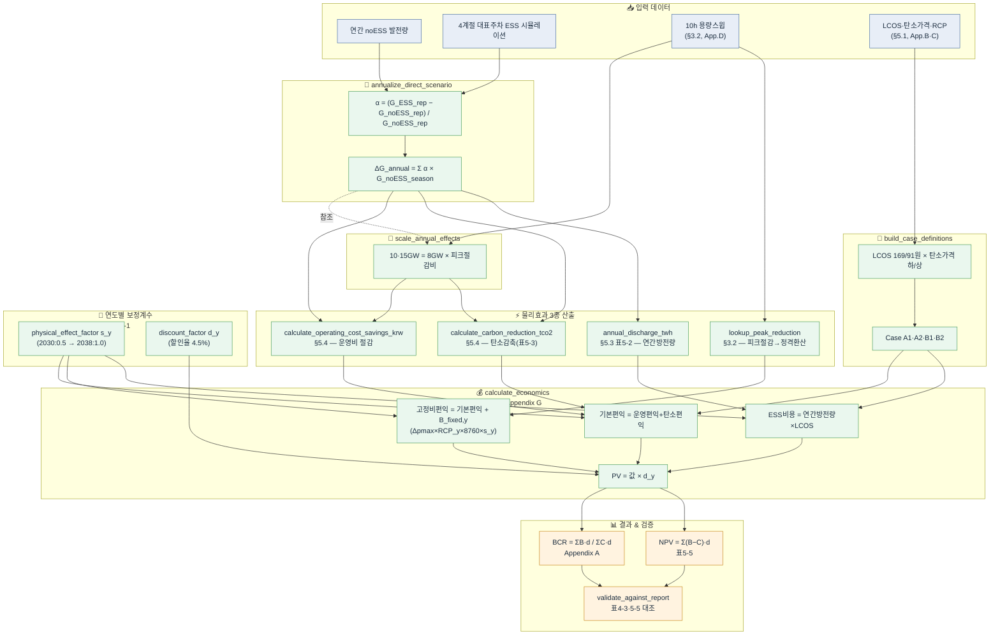
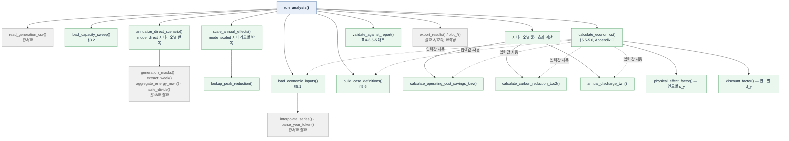

# ESS 경제성 분석 — 핵심 로직 정리

> 원본: `ess_lng_economic_analysis.py` / 대조 보고서: LNG_ESS_최종보고서_v8

## 1. 개념도 (보고서 구조 기준)

## 2. 함수 호출 계층도 (Call Graph)

s_y : 물리효과 보정계수 physical_effect_factor
- 이 분석은 원래 **2038년 딱 한 해**의 시뮬레이션 결과(운영비 절감, 탄소감축 등)만 갖고 있습니다.
- 그런데 분석 대상 기간은 **2030~2045년**이라, 2038년 값을 다른 연도에도 써야 합니다.
- 다만 2030년처럼 이른 시점에는 계통 상황(재생에너지 비중, ESS 성숙도 등)이 2038년만큼 여건이 갖춰지지 않았을 거라 보고, "2038년 효과를 100% 그대로 적용하면 과대평가"라는 문제의식에서 만든 **가중치**입니다.
- "physical_effect_start_factor": 0.5,