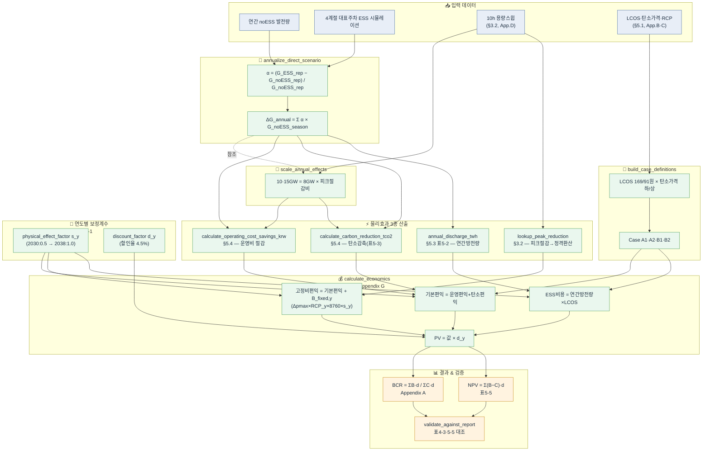
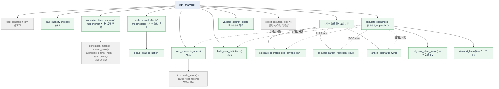

# ESS 경제성 분석 — 핵심 로직 정리

> 원본: `ess_lng_economic_analysis.py` / 대조 보고서: LNG_ESS_최종보고서_v8

## 1. 개념도 (보고서 구조 기준)

## 2. 함수 호출 계층도 (Call Graph)

## 3. 데이터 흐름 요약

1. **연간화 (§4.4)** — 4계절 대표주차의 noESS 대비 변화율(α)을 계절 전체 noESS 발전량에 곱해 2038년 ΔG_annual(원전/석탄/가스, TWh)을 얻는다. 3GW·8GW는 직접 계산(`annualize_direct_scenario`), 10GW·15GW는 8GW 결과를 피크절감비로 확대(`scale_annual_effects`)한다.

2. **물리효과 3종 (§5.3·5.4)** — ΔG_annual로부터 운영비 절감(`calculate_operating_cost_savings_krw`)과 탄소감축(`calculate_carbon_reduction_tco2`)을 산정하고, 별도로 피크절감(MW)→정격용량 환산과 ESS 연간 방전량(`annual_discharge_twh`, LCOS 비용 산정 기준)을 계산한다.

3. **Case 정의 (§5.6)** — LCOS(169/91원) × 탄소가격 경로(하한/상한) 조합으로 Case A1·A2·B1·B2를 만든다(`build_case_definitions`).

4. **연도별 확장·비용편익 (§5.2·5.5, Appendix G)** — `calculate_economics`가 2030~2045년 각 연도에 대해 물리효과 보정계수 s_y, 할인계수 d_y를 적용해 편익(운영+탄소+선택적 고정비 회피)과 비용(방전량×LCOS)을 계산하고 현재가치로 환산한다.

5. **결과·검증 (Appendix A, 표5-5)** — BCR = ΣPV편익/ΣPV비용, NPV = Σ(편익−비용)·d_y를 산출하고, `validate_against_report`가 코드 산출값을 보고서 표 4-3·5-5 원본 수치와 자동 대조한다.

> 검증 함수의 하드코딩된 기대값(예: 8GW 탄소감축 3.30MtCO₂, 운영비 412.5십억원)이 보고서 표 4-3과 정확히 일치하는 것을 확인했어요 — 코드가 보고서 계산을 충실히 재현하고 있다는 뜻입니다.